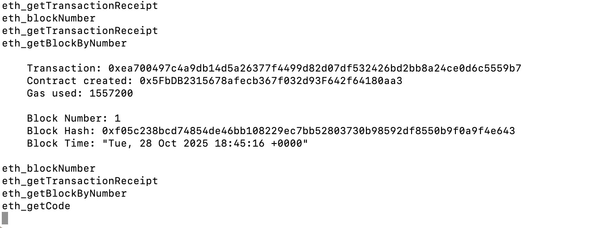
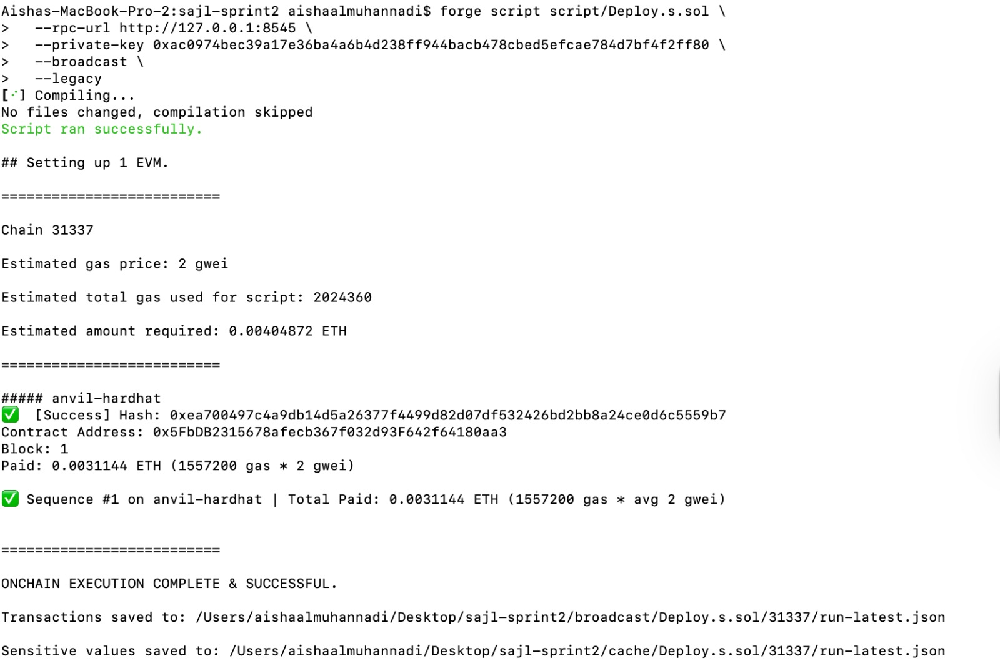
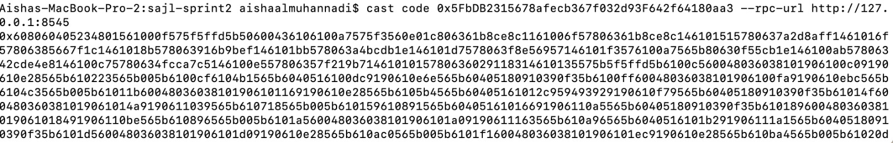

# Sprint 2 — Forge Deployment Proof (Foundry / Anvil)

**Platform:** Foundry (Anvil local blockchain)  
**Chain ID:** 31337  
**Contract Address:** `0x5FbDB2315678afecb367f032d93F642f64180aa3`  
**Contract:** SajlRegistry.sol  

## Summary
The contract was compiled and deployed successfully using Foundry’s Anvil environment.  
Output confirmed:  
`ONCHAIN EXECUTION COMPLETE & SUCCESSFUL`  
Broadcast transaction recorded in `/broadcast/Deploy.s.sol`  
Contract verified with `cast code` command.  

### Screenshots

