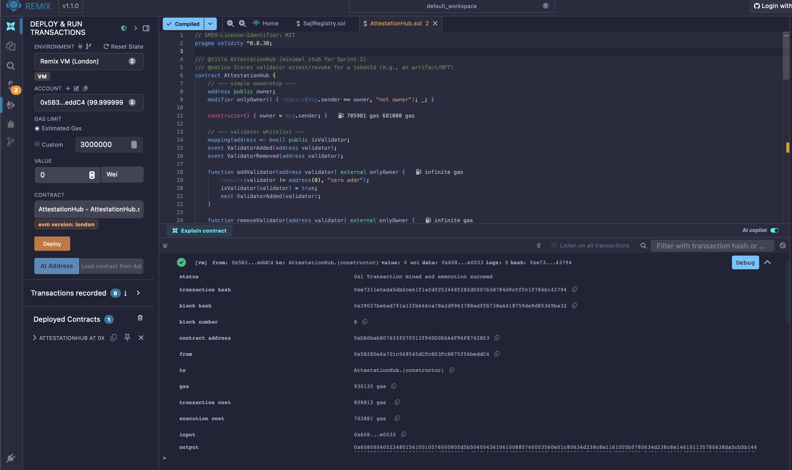
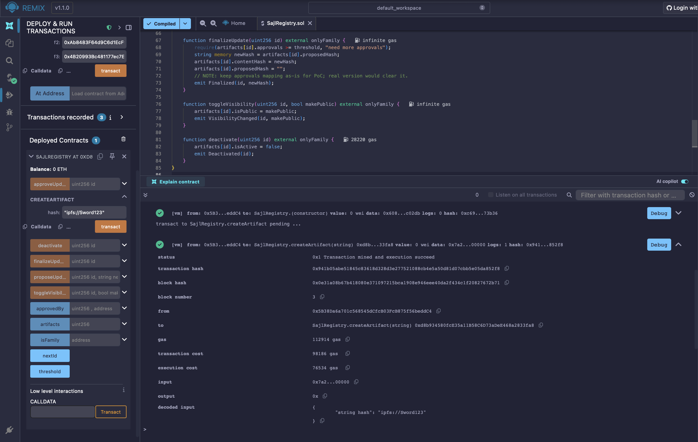
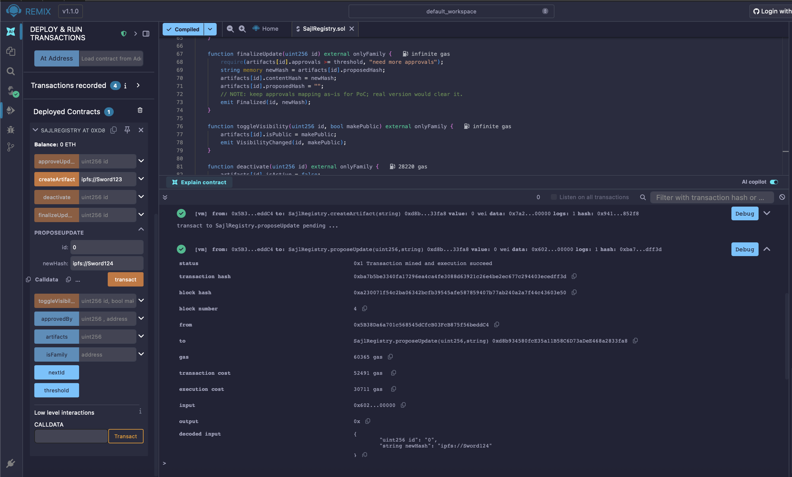
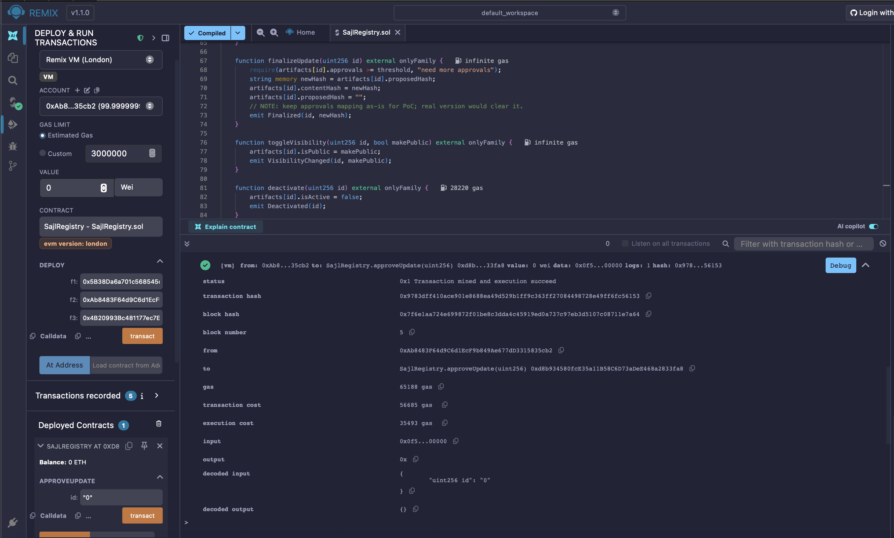
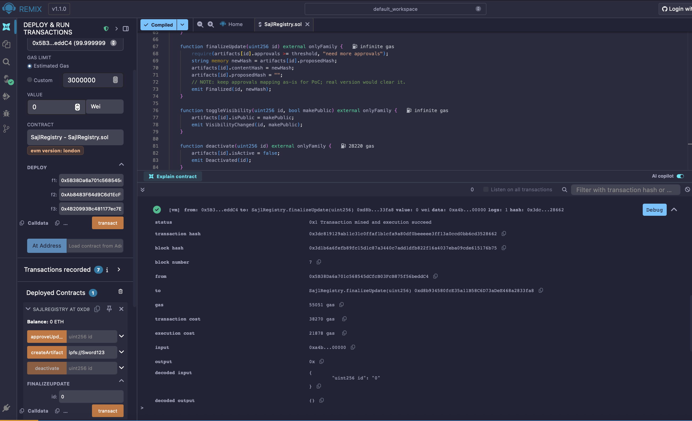
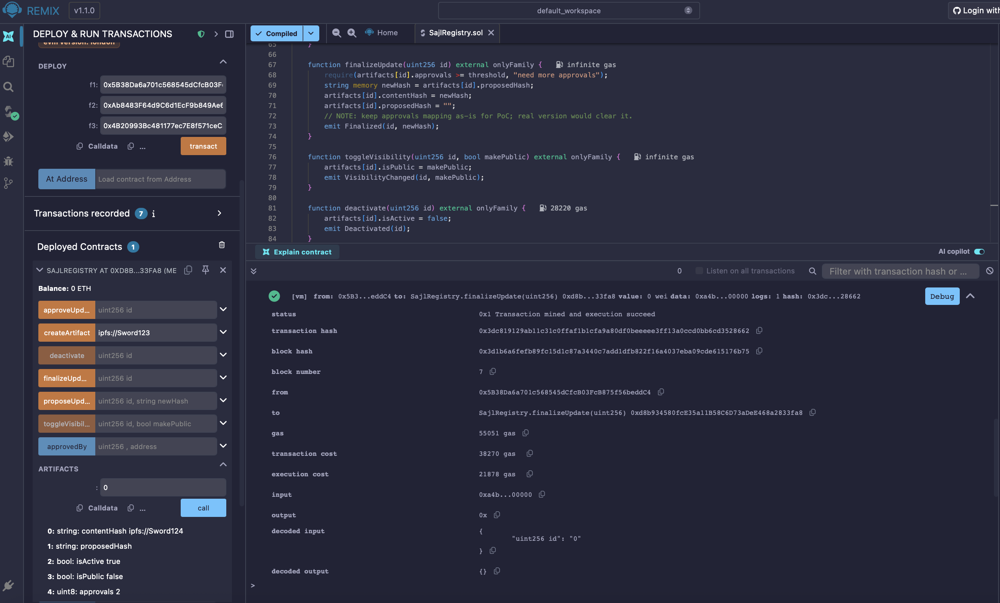

# Sprint 2 — Remix Execution Proof (SajiRegistry + AttestationHub)

**Platform:** Remix IDE (EVM: London, VM Environment)  
**Contracts:**  
- `SajiRegistry.sol`  
- `AttestationHub.sol`  

## Summary
These screenshots confirm successful compilation, deployment, and transaction execution for the SajiRegistry and AttestationHub contracts.  
The sequence demonstrates artifact creation, proposal, multi-approval workflow, finalization, and verification on the Remix environment.

---

### Execution Steps

**Compile AttestationHub**

**Create Artifact**

**Propose Update**

**First Approval**

**Second Approval**
.png)

**Finalize Update**

**Verify Artifact State**

